<div align="center">
  
  <br />
  
  <br />
  
  
  
</div>

## `> now`

```yaml
target:   AI 产品运营 / AI 产品
building: KTV 轻产品矩阵 + AI Agent 驱动的运营系统
thinking: 如何让 AI 从“能生成”走向“可交付、可控制、可复盘”
method:   insight -> workflow -> human review -> data feedback
```

我把真实业务问题编译成产品和 AI 工作流。目前围绕数据决策、销售赋能、智能客服、内容增长与用户产品实验持续构建，并在寻找 **AI 产品运营** 方向的新机会。

## `> live contribution stream`

<picture>
  <source media="(prefers-color-scheme: dark)" srcset="https://raw.githubusercontent.com/ggz-max/ggz-max/output/github-contribution-grid-snake-dark.svg" />
  <source media="(prefers-color-scheme: light)" srcset="https://raw.githubusercontent.com/ggz-max/ggz-max/output/github-contribution-grid-snake.svg" />
  
</picture>

## `> product constellation`

### `01 / DATA INTELLIGENCE` · [HL 数据平台](https://github.com/ggz-max/hl-platform)

把渠道、广告位、收入、留存与设备数据汇入经营看板，并探索自然语言问数、趋势分析、异常检测和智能报告，让运营与管理决策从“找数据”转向“问问题”。

### `02 / SALES ENABLEMENT` · [K 歌销售智能复盘系统](https://github.com/ggz-max/sales-report-system)

把销售沟通记录转化为商务总结、客户痛点、产品需求与跟进任务；围绕厂商沉淀跨对话历史，通过管理看板与飞书推送让 AI 分析进入日常销售流程。

### `03 / CUSTOMER EXPERIENCE` · [企微智能客服](https://github.com/ggz-max/gf-kefu)

以企业微信为入口，构建关键词、RAG 知识库、上下文会话、人工兜底和问题统计闭环，让客服既能 7×24 自动响应，也能持续反哺产品与知识运营。

### `04 / CONTENT GROWTH` · [新媒体运营 Agent](https://github.com/ggz-max/hl-auto-operation)

用五类 Agent 串联选题、文案、视觉、审核、发布与复盘，并接入快手 OAuth、抖音发布框架和飞书入口，把 AI 内容生成升级为可控的多平台运营供应链。

`Manager` -> `Copywriter` -> `Visual Designer` -> `Human Review` -> `Publisher` -> `Analyst`

### `05 / CONSUMER LAB` · [KTV 轻产品与小游戏矩阵](https://github.com/ggz-max/-ktv-h5-mini-games) `11 EXPERIMENTS`

基于 KTV 手机点歌的大流量入口，从用户场景与增长假设出发，用 H5 fake-door、可玩 MVP、分享机制和埋点快速验证 App 延伸机会。

`KTV 人格宇宙` · `包厢背锅王` · `搭子掼蛋` · `包厢大扫除` · `麦克风跳一跳` · `挪开这个麦` · `箭头清场王` · `切歌别手滑`

其中包含单人轻玩法、多人 WebSocket 房间、人格测试与情绪表达产品；每个实验都维护调研、PRD、实现和验证记录。搭子掼蛋已完成可联机 MVP 并部署验证。

<div align="center">
  <a href="PORTFOLIO.md"></a>
  <a href="https://github.com/ggz-max?tab=repositories"></a>
</div>

## `> recent signals`

<!-- ACTIVITY:START -->
- `PUSH` 1 commit(s) -> [ggz-max/-ktv-h5-mini-games](https://github.com/ggz-max/-ktv-h5-mini-games)
- `CREATE` branch `main` in [ggz-max/-ktv-h5-mini-games](https://github.com/ggz-max/-ktv-h5-mini-games)
<!-- ACTIVITY:END -->

<sub>由 GitHub Actions 每 6 小时同步公开活动，自动忽略本主页仓库的更新。</sub>

---

<div align="center">
  <code>BUSINESS PROBLEM -> AI SYSTEM -> MEASURABLE OUTCOME</code>
</div>
