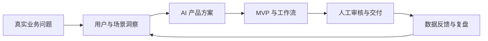

<div align="center">
  
</div>

<div align="center">
  <a href="https://github.com/ggz-max?tab=repositories"></a>
  
  
</div>

## `> 关于我`

我正在寻找 **AI 产品运营** 方向的机会。

我关注的不是“接入一个模型”，而是如何把 AI 变成真正可用、可控、可复盘的业务能力：从识别用户与运营痛点，设计 PRD 和工作流，到搭建 MVP、接入真实业务渠道，再根据反馈持续迭代。

```text
ROLE      AI 产品运营 / AI 产品
DOMAIN    内容增长 · 智能客服 · 销售复盘 · 经营分析
METHOD    用户问题 -> 产品方案 -> AI 工作流 -> 人工校验 -> 数据复盘
STATUS    正在寻找新的机会
```

## `> 我的工作方式`

| 01 / 洞察 | 02 / 设计 | 03 / 落地 | 04 / 增长 |
| :--- | :--- | :--- | :--- |
| 从真实业务流程中定位重复劳动、信息断点和体验问题 | 定义用户、场景、指标、状态机与人机协作边界 | 用 AI 与自动化快速搭建 MVP，打通 API 和业务渠道 | 通过审核、日志、看板和复盘数据持续优化 |

## `> 代表项目 / Proof of Work`

### [欢乐歌房内容自动化](https://github.com/ggz-max/hl-auto-operation) `AI Agent · Content Ops · Growth`

> 将多平台内容运营拆解成可配置、可审核、可追踪的 AI 工作流。

- 设计 Manager、Copywriter、Visual Designer、Publisher、Analyst 五类 AI 运营角色
- 串联选题、文案、图片/视频、待审队列、发布日志和数据复盘
- 接入快手 OAuth 与视频发布链路，并为抖音、小红书设计差异化发布策略
- 通过人工审核闸门和发布状态机控制内容质量与平台风险

`关键词：多 Agent 协作 / 内容供应链 / Human-in-the-loop / 平台 API / 飞书入口`

---

### [企微智能客服系统](https://github.com/ggz-max/gf-kefu) `RAG · Customer Experience · Operations`

> 面向歌房 App 高频咨询，搭建从自动应答到人工兜底的客服闭环。

- 从业务现状出发完成分阶段 PRD，覆盖欢迎语、关键词、RAG、转人工与运营看板
- 建设产品 FAQ 知识库，围绕会员、投屏、歌曲、退款等高频场景组织内容
- 对接微信客服消息链路，记录会话、回复方式与问题类型
- 将“回答不了”作为产品边界，设计安全转人工和后续知识库优化路径

`关键词：用户体验 / 知识库运营 / RAG / 企微生态 / 数据看板`

---

### [K 歌销售智能复盘系统](https://github.com/ggz-max/sales-report-system) `AI Analysis · Sales Ops · CRM`

> 把分散的销售对话转化为可追踪的客户洞察、产品需求和下一步行动。

- 支持上传销售沟通记录并调用 AI 生成商务总结、销售复盘、产品需求和待办
- 围绕厂商沉淀跨对话历史，呈现合作阶段、痛点、签约概率与跟进任务
- 设计销售端与管理端双视角，通过飞书推送让分析结果进入日常协作
- 将非结构化沟通内容转化为结构化业务资产，帮助团队减少信息损耗

`关键词：销售赋能 / 对话分析 / 需求挖掘 / 飞书协同 / 数据资产`

---

### [HL 数据平台](https://github.com/ggz-max/hl-platform) `Data Product · BI · AI Assistant`

> 让渠道、收入、留存和转化数据从“能看”走向“能问、能解释、能决策”。

- 聚合总览、渠道、广告位、体验与设备到期等经营数据
- 面向管理、运营、商务与财务设计角色化数据视图
- 规划自然语言数据问答、趋势对比、异常检测和智能报告能力
- 用真实业务问题定义 AI Tool Use，让模型查询数据而不是凭空回答

`关键词：经营分析 / 指标体系 / 自然语言问数 / 数据可视化 / 决策支持`

<details>
<summary><b>Engineering Side Quest / AI 基础设施实践</b></summary>
<br />

[CLIProxyAPI Plus](https://github.com/ggz-max/cliproxy-plus) 是基于开源项目的定制 fork。我在上游能力之上扩展了 AnyRouter Provider、GitHub Copilot OAuth、配额展示和管理面板能力，用于理解多模型接入、账户管理、路由与可用性保障。

</details>

## `> 能力矩阵`

| 产品与运营 | AI 应用 | 数据与增长 | 技术协作 |
| :--- | :--- | :--- | :--- |
| 用户场景与需求拆解 | Prompt 与 Agent 工作流 | 指标体系与运营看板 | API / OAuth / Webhook |
| PRD 与 MVP 规划 | RAG 与知识库运营 | 内容策略与效果复盘 | Python / JavaScript / SQL |
| 流程、权限与状态机 | Human-in-the-loop | 销售与客服流程优化 | Git / FastAPI / Vue |

<div align="center">
  
</div>

## `> 当前探索`



- 更可靠的多 Agent 协作、任务编排和长期记忆
- AI 内容生产中的质量标准、审核机制与跨平台增长
- RAG 产品中的知识治理、拒答策略和人工兜底
- 从自然语言问数到可执行运营建议的数据产品体验

## `> GitHub Signal`

<div align="center">
  
  
</div>

---

<div align="center">
  <code>正在寻找 AI 产品运营方向机会</code><br /><br />
  <a href="https://github.com/ggz-max">通过 GitHub 了解我与我的项目</a>
</div>
